# 恒星识别系统 (Star Identification System)

[](https://wakatime.com/badge/user/a7b329b7-d489-40d2-9239-8be7cf83b65e/project/018d0c19-921c-4e32-b5ce-f4af890fa9eb)
[](https://www.python.org/)
[](LICENSE)

[](https://github.com/Zhytou/star-identification/stargazers)
[](https://github.com/Zhytou/star-identification/network/members)
[](https://twitter.com/intent/tweet?text=Check%20out%20this%20awesome%20star%20identification%20system!&url=https%3A%2F%2Fgithub.com%2FZhytou%2Fstar-identification)

- [恒星识别系统 (Star Identification System)](#恒星识别系统-star-identification-system)
  - [🚀 快速开始](#-快速开始)
  - [📂 项目结构](#-项目结构)
  - [🛠️ 核心功能](#️-核心功能)
    - [🌌 星图仿真](#-星图仿真)
    - [🔍 星点提取](#-星点提取)
    - [🎯 星图识别](#-星图识别)

## 🚀 快速开始

```bash
# clone the repo
git clone https://github.com/Zhytou/star-identification.git  
cd star-identification  

# install all the packages
pip install -r requirements.txt  

# run realshot test
python -m scripts.chapter4_draw
```

## 📂 项目结构

- 星图仿真：simulate.py | view.py
- 星图预处理：denoise.py | detect.py | extract.py
- 特征生成：generate.py | aggregate.py
- 模型相关：train.py | model.py | dataset.py
- 算法测试：test.py | realshot.py | scripts/*.py
- 星表处理：catalogue.py
- 工具函数：utils.py

## 🛠️ 核心功能

### 🌌 星图仿真

**仿真原理**：

1. **恒星筛选**：基于视轴方向与恒星的角距筛选可见恒星。

$$
    \theta=arccos{\vec{v_{axis}}\cdot\vec{v_{star}}}\le FOV/2
$$

2. **坐标计算**：完成从赤经赤纬到像素坐标的转换。
  
<div align="center">
    <p>赤经赤纬 → 天球直角坐标</p>
    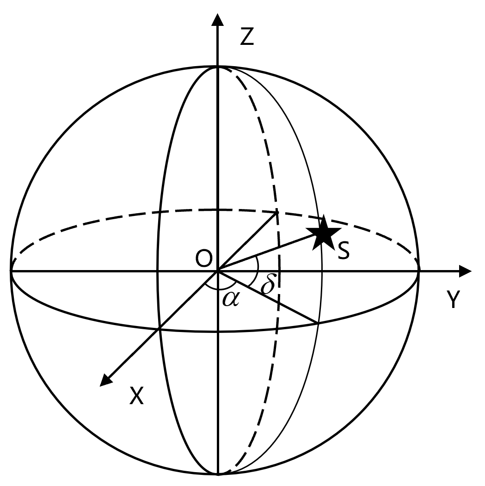
</div>

$$
    \begin{pmatrix}
        x \\
        y \\
        z
    \end{pmatrix} =
    \begin{pmatrix}
        \cos\alpha \cos\delta \\
        \sin\alpha \cos\delta \\
        \sin\delta
    \end{pmatrix}
$$

<div align="center">
    <p>天球直角坐标 → 星敏感器坐标</p>
    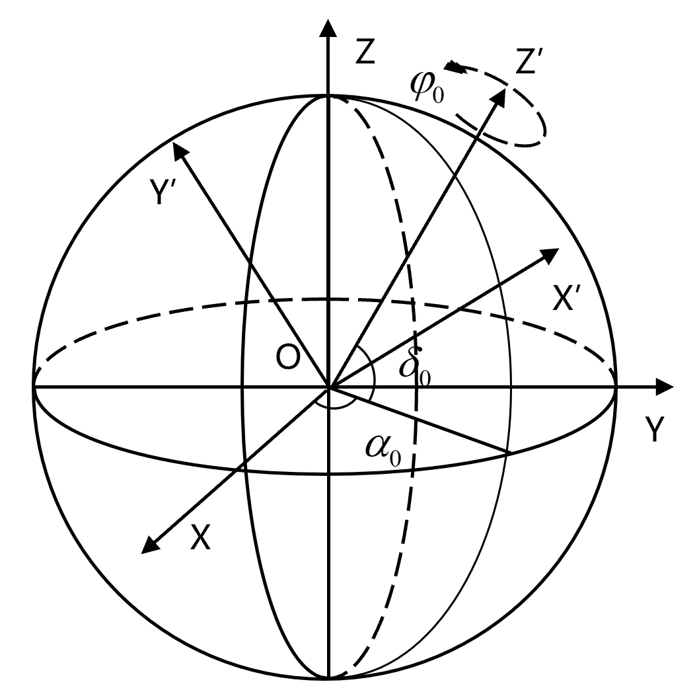
</div>
    
$$
    \begin{pmatrix}
        x' \\
        y' \\
        z'
    \end{pmatrix} =
    M \cdot
    \begin{pmatrix}
        x \\
        y \\
        z
    \end{pmatrix}
$$

$$
    M = \begin{pmatrix}
        \cos\varphi_0 & \sin\varphi_0 & 0 \\
        -\sin\varphi_0 & \cos\varphi_0 & 0 \\
        0 & 0 & 1
    \end{pmatrix} \cdot
    \begin{pmatrix}
        1 & 0 & 0 \\
        0 & \cos(\pi/2-\delta_0) & \sin(\pi/2-\delta_0) \\
        0 & -\sin(\pi/2-\delta_0) & \cos(\pi/2-\delta_0)
    \end{pmatrix} \cdot
    \begin{pmatrix}
        \cos(\pi/2+\alpha_0) & \sin(\pi/2+\alpha_0) & 0 \\
        -\sin(\pi/2+\alpha_0) & \cos(\pi/2+\alpha_0) & 0 \\
        0 & 0 & 1
    \end{pmatrix}
$$

<div align="center">
    <p>星敏感器坐标 → 像平面坐标</p>
    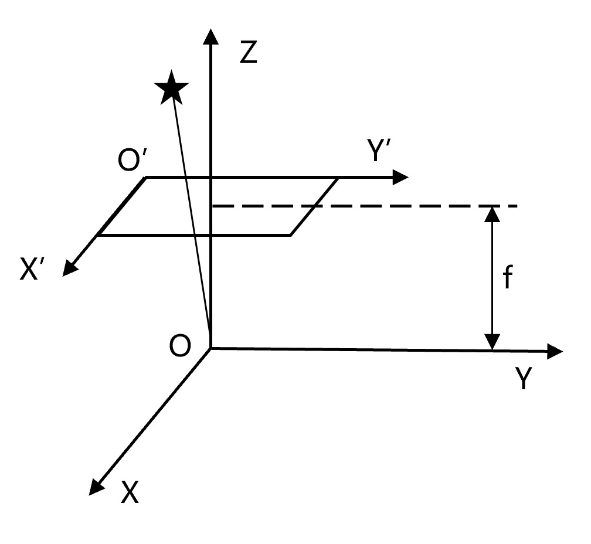
</div>

$$
    \begin{cases}
        col = \frac{w}{2}+\frac{x'}{z'}\cdot\frac{f}{d} \\
        row = \frac{h}{2}+\frac{y'}{z'}\cdot\frac{f}{d}
    \end{cases}
$$

3. **灰度确定**：基于二维高斯函数的PSF模型。

$$
    I(x, y) = I_0 \cdot exp^{\frac{(x-x_0)^2+(y-y_0)^2}{2\sigma^2}}
$$

**运行效果**：

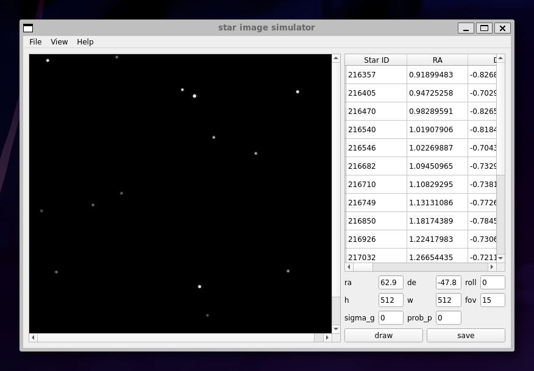

### 🔍 星点提取

**提取流程**：

1. **星图降噪**:

- 中值/高斯/双边滤波等
- 小波变换
- 形态学操作

2. **图像增强**：（面对非均匀背景星图，强化目标与背景间差异）

- 背景残差预测
- 局部对比度

3. **星点区域定位**

- 全局阈值分割 + 连通域标记
- 斑点检测算子 + 局部阈值分割 + 区域生长

4. **亚像素质心算法**：

- 曲线拟合法
- 灰度质心法

**检测效果**：

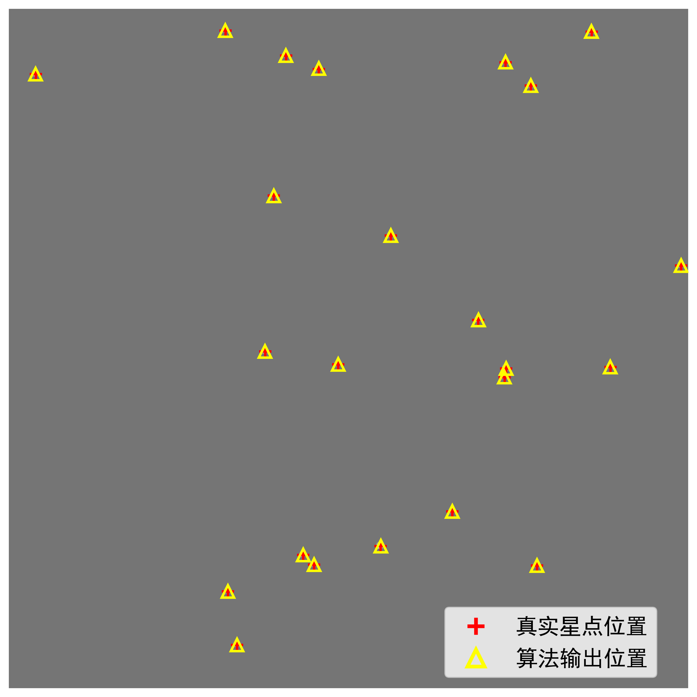

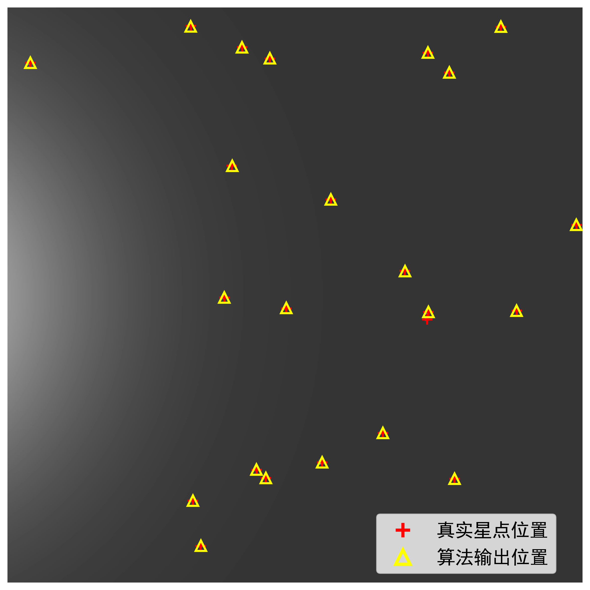

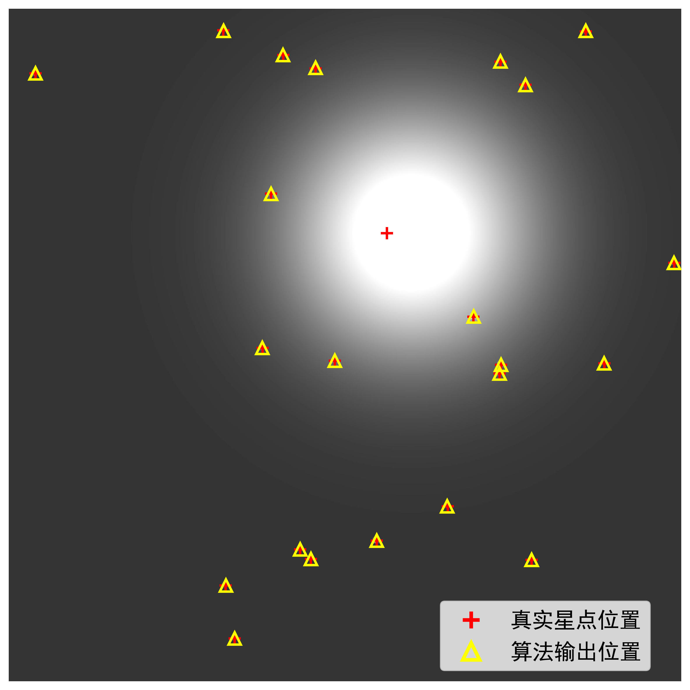

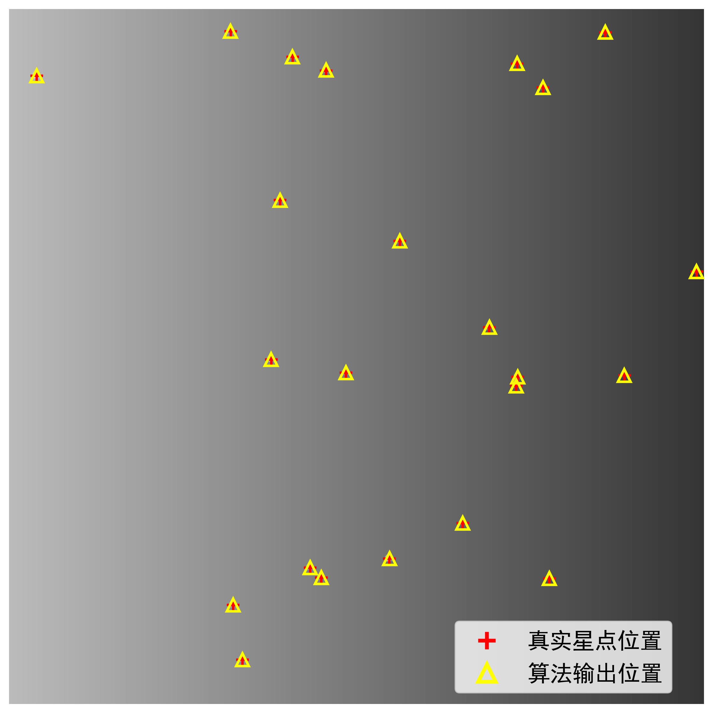


### 🎯 星图识别

**RAC算法流程**：

- 选点主星
- 构建特征
- 模型识别
- 视场约束
- 角距匹配

**实拍测试**：

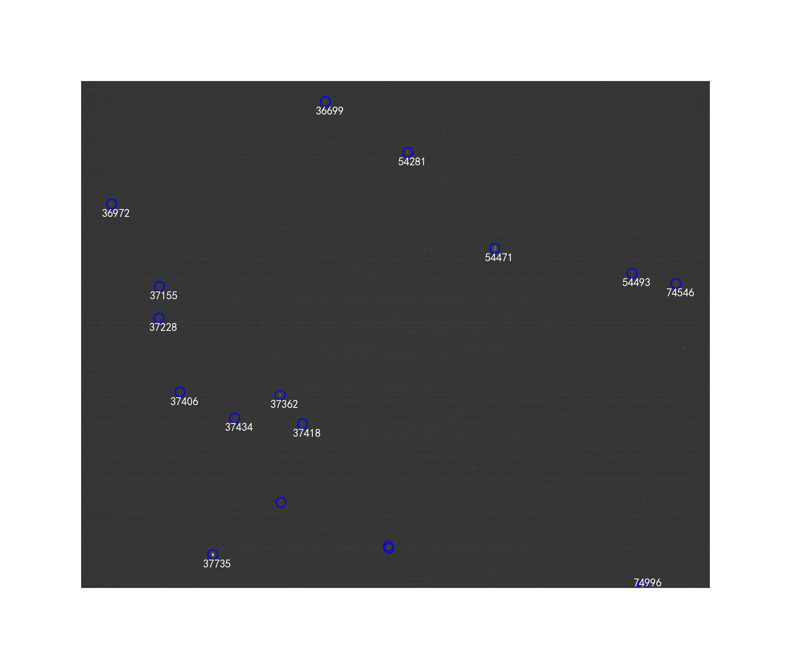

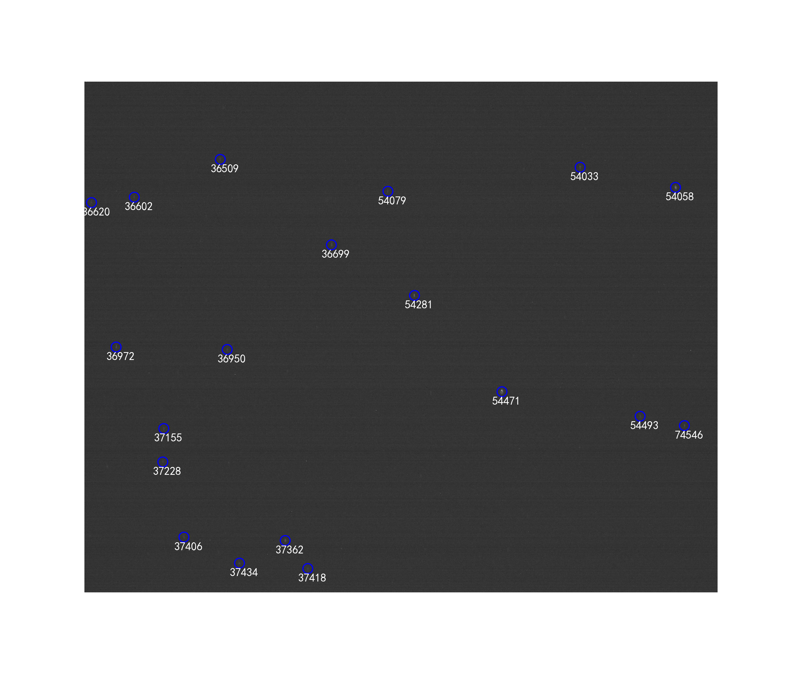

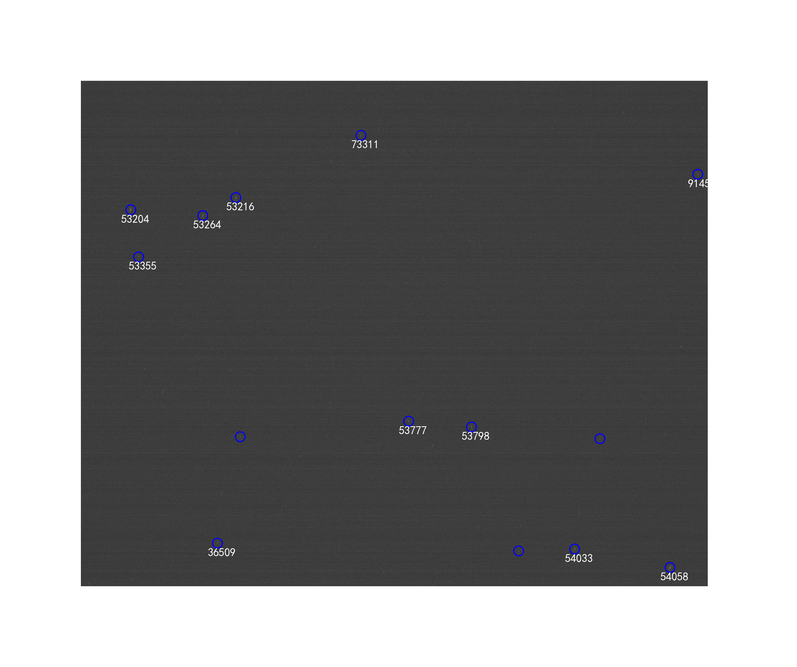
