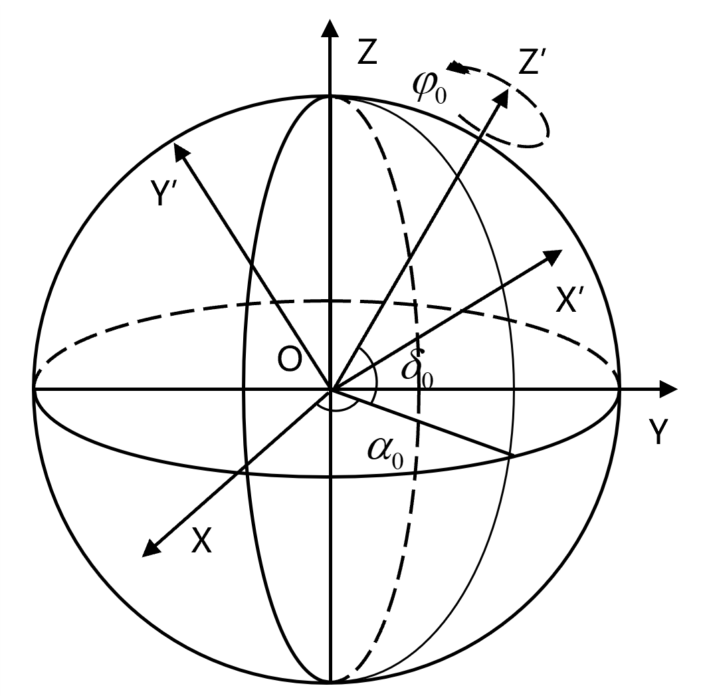

# Star Identification

 

- [Star Identification](#star-identification)
  - [项目结构](#项目结构)
  - [星图仿真](#星图仿真)
    - [仿真原理](#仿真原理)
  - [图像预处理](#图像预处理)
    - [降噪处理](#降噪处理)
    - [星点检测](#星点检测)
    - [质心计算](#质心计算)
  - [星图识别](#星图识别)
    - [特征生成](#特征生成)
    - [识别流程](#识别流程)
  - [运行结果](#运行结果)

## 项目结构

项目大致可以分成七部分：

- 星图仿真：simulate.py | view.py
- 星图预处理：denoise.py | detect.py | extract.py
- 特征生成：generate.py | aggregate.py
- 模型相关：train.py | model.py | dataset.py
- 算法测试：test.py | realshot.py | scripts/*.py
- 星表处理：catalogue.py
- 工具函数：utils.py

## 星图仿真

星图仿真是指在给定星敏感器位置和视轴指向的情况下，模拟生成其应当观察到的对应部分天空图像。

### 仿真原理

**恒星筛选**:

其中，恒星筛选可以使用视轴方向与恒星间矢量角距判断，也可以使用如下公式初步筛选：

**坐标转换**：


$$
\begin{pmatrix}
x \\ y \\ z
\end{pmatrix} =
\begin{pmatrix}
\cos\alpha \cos\delta \\
\sin\alpha \cos\delta \\
\sin\delta
\end{pmatrix}
$$



其中，矩阵M是天球直角坐标系到星敏感器坐标系的旋转矩阵，它实际是三次旋转操作的组合变换。如图 2.8所示，对于星敏感器坐标系O-X′Y′Z′而言，它可由天球直角坐标系O-XYZ经过三次旋转得到。具体而言，天球直角坐标系O-XYZ首先需要沿Z轴旋转 ，使得旋转后X轴位于OX′Y′平面内。接着，沿新X轴旋转 ，使得新Z轴与目标Z’轴对齐。最后，再沿Z′轴旋转 ，便可得到星敏感器坐标系O-X′Y′Z′。

$$
M =
\begin{pmatrix}
cos\varphi & sin\varphi & 0 \\
-sin\varphi & cos\varphi & 0 \\
0 & 0 & 1
\end{pmatrix}
\cdot
\begin{pmatrix}
cos\varphi & sin\varphi & 0 \\
-sin\varphi & cos\varphi & 0 \\
0 & 0 & 1
\end{pmatrix}
\cdot
\begin{pmatrix}
cos\varphi & sin\varphi & 0 \\
-sin\varphi & cos\varphi & 0 \\
0 & 0 & 1
\end{pmatrix}
$$

$$
\begin{cases}
col = \frac{w}{2}+\frac{x}{z}\cdot\frac{f}{d} \\
row = \frac{h}{2}+\frac{y}{z}\cdot\frac{f}{d}
\end{cases}
$$

**灰度确定**：

## 图像预处理

### 降噪处理

### 星点检测

### 质心计算

## 星图识别

### 特征生成

### 识别流程

## 运行结果

``` bash
# 
python -m scripts.chapter2_draw

# 
python -m scripts.chapter3_draw

# 
python -m scripts.chapter4_draw
```
